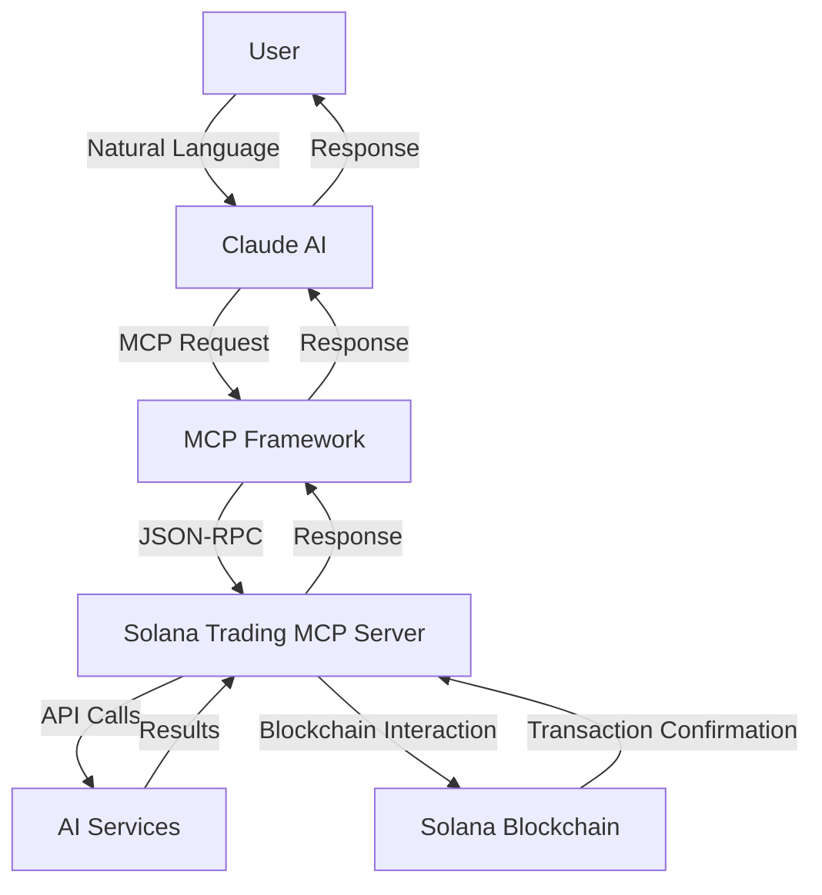

Below is a rewritten and perfected version of the guide for **The Cheshire Terminal: Solana Token Launch MCP Server**. This version enhances clarity, provides detailed explanations, includes practical examples, and improves readability with better formatting. It’s designed to be comprehensive and user-friendly for both beginners and experienced users.

---

# The Cheshire Terminal: Solana Token Launch MCP Server

> *"We're all mad here. I'm mad. You're mad." - The Cheshire Cat*

Welcome to the ultimate guide for the **Cheshire Terminal**, a groundbreaking Solana Token Launch MCP Server that harnesses artificial intelligence to revolutionize blockchain token creation. This guide covers everything you need to know: what we’ve built, how it operates, and how to integrate it with Claude AI to create an intuitive, AI-driven token launching system.

## Table of Contents

- [Introduction](#introduction)
- [System Architecture](#system-architecture)
- [Key Components](#key-components)
- [Features](#features)
- [Integration with Claude Desktop](#integration-with-claude-desktop)
- [Using the MCP Server](#using-the-mcp-server)
- [Advanced Topics](#advanced-topics)
- [API Reference](#api-reference)
- [Troubleshooting](#troubleshooting)

---

## Introduction

The **Cheshire Terminal** introduces a fresh approach to token creation by blending advanced AI technologies with the Solana blockchain. Acting as a bridge between human creativity and blockchain functionality, it enables users to craft token concepts, artwork, and unique identifiers—all through simple natural language commands.

Inspired by the elusive Cheshire Cat from *Alice in Wonderland*, this system emerges when called upon, delivering enigmatic yet potent guidance through the intricate world of token creation. It turns abstract ideas into concrete digital assets with ease, making token launching accessible to all.

### What We Built Today

Today, we achieved the following milestones:

1. **Integrated the Solana Trading MCP Server with Claude Desktop**: Seamlessly connected our custom server with Claude’s interface.
2. **Configured API Keys and Environment Variables**: Set up all necessary credentials for smooth operation.
3. **Established Bidirectional Communication**: Enabled real-time interaction between Claude and our server.
4. **Activated Natural Language Token Creation**: Allowed users to launch tokens using everyday language.

This integration empowers Claude to go beyond traditional AI tasks, diving into blockchain token creation and offering users a fluid, natural language-driven experience.

### Why Solana?

Solana is a high-performance blockchain celebrated for its speed, low-cost transactions, and scalability. It’s the perfect platform for token creation thanks to its support for SPL (Solana Program Library) tokens—fast, affordable alternatives to Ethereum’s ERC-20 tokens.

### Benefits of AI-Powered Token Creation

- **Simplicity**: No technical skills required—create tokens with plain language.
- **Creativity**: AI crafts unique token designs, artwork, and identifiers.
- **Speed**: Automates complex processes, saving time and effort.

---

## System Architecture

The Cheshire Terminal operates on the **Model Context Protocol (MCP)** architecture, enabling AI models like Claude to interact with specialized external servers.

### Architecture Diagram

Here’s a visual representation of the system flow:



### Key Components

1. **Claude AI**: The user’s primary interface, interpreting requests and delegating token-related tasks to the server.
2. **MCP Framework**: A secure protocol facilitating communication between Claude and external servers.
3. **Solana Trading MCP Server**: A JSON-RPC server that handles token creation and blockchain operations.
4. **AI Services**: Specialized external tools integrated into the server:
   - **xAI/Grok**: Generates token concepts.
   - **FAL.ai**: Creates token artwork.
   - **NVIDIA DNA Generator**: Produces unique identifiers.
5. **Solana Blockchain**: The platform where tokens are deployed, supporting both testnet and mainnet.

### How It Works

- The user sends a natural language request to Claude (e.g., “Create a token about cats”).
- Claude forwards it to the MCP Framework, which routes it to the Solana Trading MCP Server.
- The server collaborates with AI services for concepts and artwork, then interacts with Solana to deploy the token.
- Results flow back through the same chain, delivering the outcome to the user via Claude.

---

## Key Components

Here’s a deep dive into the core elements powering the Solana Trading MCP Server:

### 1. SolanaTradeServer

The **SolanaTradeServer** is the system’s backbone—a custom JSON-RPC server that processes Claude’s requests and manages subsystems.

```javascript
const handleLaunchToken = async (id, args) => {
  const { deployer_private_key, name, symbol, metadataUri, prompt, network } = args;
  // Logic to generate image and deploy token
  sendResponse(id, { signature, imageUrl });
};
```

It simplifies complex operations like token generation and blockchain deployment into callable methods.

### 2. Token Launcher

This module connects directly to Solana, managing token creation and deployment.

```typescript
export async function launchToken(
  deployerPrivatekey: string,
  name: string,
  symbol: string,
  uri: string,
  network: string = 'devnet'
): Promise<string> {
  // Solana Web3.js token creation logic
}
```

**Key Tasks**:
- Connects to Solana (devnet or mainnet).
- Generates token keypairs.
- Sets up metadata and bonding curves.
- Executes deployment transactions.

### 3. AI Token Creator

Powered by **xAI/Grok**, this module generates creative token concepts from user prompts.

```typescript
async function generateTokenDetails(theme?: string): Promise<TokenDetails> {
  const completion = await xaiClient.chat.completions.create({
    model: "grok-2-latest",
    messages: [
      { "role": "system", "content": "You are a cryptocurrency expert..." },
      { "role": "user", "content": theme }
    ],
    temperature: 0.8
  });
  // Parse AI response into token details
}
```

**Functions**:
- Turns themes into detailed token ideas.
- Produces names, symbols, and descriptions.

### 4. Image Generator

Using **FAL.ai’s fast-lightning-sdxl**, this component creates high-quality token artwork.

```typescript
async function generateTokenArtwork(prompt: string): Promise<string> {
  const result = await fal.subscribe("fal-ai/fast-lightning-sdxl", {
    input: {
      prompt: prompt,
      image_size: "square_hd",
      num_inference_steps: "4"
    }
  });
  return result.images[0].url;
}
```

**Features**:
- Transforms text into visuals.
- Offers real-time generation feedback.
- Delivers polished token logos.

### 5. DNA Service

The **NVIDIA DNA Generator** provides unique, biologically-inspired token identifiers.

```typescript
export async function generateDNASequence(params: DNAGenerationParams): Promise<DNAGenerationResult> {
  const response = await fetch('https://api.nvidia.com/health/arc-evo2-40b/v1/generate', {
    // API call details
  });
  // Return DNA sequence
}
```

**Capabilities**:
- Generates unique DNA sequences.
- Visualizes them with color-coded nucleotides.
- Includes probability distributions.

---

## Features

The Cheshire Terminal stands out with these innovative features:

### 1. AI-Powered Token Generation
Describe your idea, and the system builds a complete token package:
- Name and symbol
- Description and use case
- Artwork
- Deployment settings

**Example**: “A token for ocean conservation” becomes a fully realized asset.

### 2. Multi-Model AI Orchestration
Combines top-tier AI tools:
- xAI/Grok for concepts
- FAL.ai for images
- NVIDIA DNA Generator for identifiers

### 3. Blockchain Deployment
Deploys tokens to:
- **Solana Devnet**: For testing
- **Solana Mainnet**: For live launches

Handles SPL token creation, metadata, and transaction signing.

### 4. Real-time Feedback
Provides live updates during:
- Image generation
- Token deployment
- Error detection

### 5. Claude Integration
Enables:
- Natural language interaction
- Clear explanations
- Step-by-step guidance

---

## Integration with Claude Desktop

### What We Did Today

We linked the Solana Trading MCP Server with Claude Desktop, enabling direct interaction. Steps included:

1. Compiled TypeScript files into JavaScript.
2. Moved the server to the `dist` directory.
3. Updated Claude’s configuration file:

```json
{
  "mcpServers": {
    "solana-trading": {
      "command": "node",
      "args": ["/Users/8bit/launcmcp/Solana-Trading-MCP-Server/dist/SolanaTradeServer.js"],
      "env": {
        "FAL_KEY": "41314353-356d-48ed-ab91-a0645391cc22:f3272fe3b4dc282bef43f6b7647c3f9c",
        "FAL_SECRET": "fs-Ot5Uf3AQBKM2kOHCwOdxpnvVZPCZQYdLpGXBOHIUoUXOYMnMZuBwRHNEpTULdKQdZAaQvuRbWzgPa",
        "XAI_API_KEY": "xai-3qpIlnkFMkadIwCTvKmhH7WHrSQaQQ9UGeBoX0czJM8xPSQsyepisrdxeRLnZjWpaaDtiAwvTzv2zbP6",
        "HELIUS_RPC_URL": "https://mainnet.helius-rpc.com/?api-key=1771237b-e3a5-49cb-b190-af95b2113788",
        "OPENAI_API_KEY": "sk-xai-3qpIlnkFMkadIwCTvKmhH7WHrSQaQQ9UGeBoX0czJM8xPSQsyepisrdxeRLnZjWpaaDtiAwvTzv2zbP6",
        "NVIDIA_API_KEY": "nvapi-eyJhbGciOiJIUzI1NiIsInR5cCI6IkpXVCJ9.eyJzdWIiOiJkbmEtZ2VuZXJhdG9yLWFwaSIsImV4cCI6MTcwOTI1MjgwMH0.XYZ123ABC",
        "PRIVATE_KEY": "2uLPPgFspK9cMThZqZJTPn1yRX4uQSECsh2GGZAj2P4vb2QSvGeWGmb8kSqLWNV9E8W4pBZTeCuAfyAiA4odn37m"
      },
      "disabled": false,
      "autoApprove": []
    }
  }
}
```

### How MCP Works

The **Model Context Protocol (MCP)** extends Claude’s abilities by connecting it to external servers:

1. User inputs a request (e.g., “Make a token for a music festival”).
2. Claude detects the need for specialized tools.
3. The MCP Framework sends the request to the Solana Trading MCP Server.
4. The server processes it and returns results.
5. Claude delivers the outcome to the user.

### Setup Guide

1. **Prerequisites**: Install Node.js, TypeScript, and Claude Desktop.
2. **Build**: Run `tsc` in the project directory.
3. **Deploy**: Copy compiled files to `dist`.
4. **Configure**: Add the above JSON to Claude’s config file.
5. **Launch**: Restart Claude Desktop.

---

## Using the MCP Server

### Available Tools

The server offers these tools via Claude:

1. **`launch_token`**:
   ```json
   {"name": "launch_token", "arguments": {"deployer_private_key": "key", "name": "MusicFest", "symbol": "MF", "prompt": "A vibrant festival logo"}}
   ```
2. **`generate_image`**:
   ```json
   {"name": "generate_image", "arguments": {"prompt": "A colorful stage with lights"}}
   ```
3. **`chat_with_grok`**:
   ```json
   {"name": "chat_with_grok", "arguments": {"messages": [{"role": "user", "content": "Suggest a token idea"}]}}
   ```
4. **`generate_dna`**:
   ```json
   {"name": "generate_dna", "arguments": {"sequence": "ATGC", "temperature": 0.7, "max_length": 50}}
   ```
5. **`generate_token_details`**:
   ```json
   {"name": "generate_token_details", "arguments": {"theme": "music festival"}}
   ```

### Examples

1. **Basic Token**:
   - **User**: “Create a token for a music festival.”
   - **Claude**: Generates “MusicFest (MF)” with a stage-themed logo on devnet.

2. **Custom Token**:
   - **User**: “Make a token called PARTY with a disco ball image.”
   - **Claude**: Deploys “PARTY” with a disco ball artwork.

3. **DNA Token**:
   - **User**: “Generate a DNA sequence for a biotech token.”
   - **Claude**: Returns a color-coded sequence like “ATCG…” (A=Green, T=Blue).

---

## Advanced Topics

### Testing Modes

- **Mock Test**: `TEST_MODE=true MOCK=true node dist/test-ai-token.js` (No blockchain).
- **Devnet Test**: `TEST_MODE=true NETWORK=devnet node dist/test-ai-token.js` (Simulated deployment).
- **Live Launch**: `TEST_MODE=false NETWORK=mainnet node dist/test-ai-token.js` (Real tokens).

### Real-time Image Generation

```typescript
const result = await fal.subscribe("fal-ai/fast-lightning-sdxl", {
  input: { prompt: "A glowing cat" },
  logs: true,
  onQueueUpdate: (update) => console.log(update.logs)
});
```

Users see progress updates during image creation.

### DNA Visualization

- **Colors**: A (Green), T (Blue), G (Yellow), C (Red).
- **Details**: Includes probability stats for each nucleotide.

---

## API Reference

### JSON-RPC Methods

- **Launch Token**:
  ```json
  {"jsonrpc": "2.0", "id": 1, "method": "callTool", "params": {"name": "launch_token", "arguments": {"name": "CatCoin", "symbol": "CAT", "prompt": "A cute cat", "network": "devnet"}}}
  ```
  **Response**: `{"signature": "5K...", "imageUrl": "https://..."}`

- **Generate Image**:
  ```json
  {"jsonrpc": "2.0", "id": 2, "method": "callTool", "params": {"name": "generate_image", "arguments": {"prompt": "A glowing cat"}}}
  ```
  **Response**: `{"imageUrl": "https://..."}`

### Environment Variables

| Variable         | Description                  | Example Value                          |
|------------------|------------------------------|----------------------------------------|
| FAL_KEY          | FAL.ai API Key               | 41314353-356d-...                      |
| XAI_API_KEY      | xAI/Grok API Key             | xai-3qpIlnkFMk...                      |
| HELIUS_RPC_URL   | Solana RPC URL               | https://mainnet.helius-rpc.com/...     |
| PRIVATE_KEY      | Solana Private Key           | 2uLPPgFspK9cMThZ...                   |

---

## Troubleshooting

### Common Issues

1. **API Errors**: Check keys for validity and expiration.
2. **Transaction Fails**: Ensure RPC URL is correct and SOL balance is sufficient.
3. **Server Issues**: Verify config paths and restart Claude.

### Logging

Add logs like:
```javascript
console.error('Request failed:', error);
```

Check logs for errors or successful steps.

---

## Conclusion

The Cheshire Terminal redefines token creation by merging AI and blockchain technology. With Claude’s guidance, it simplifies the process, making it accessible and engaging. Like the Cheshire Cat, it offers whimsical yet effective support, disappearing once your token is launched.

> *"Begin at the beginning," the King said, very gravely, "and go on till you come to the end: then stop."*

Happy token launching!

---

*The Cheshire Terminal | © 2025 | Version 1.0*
